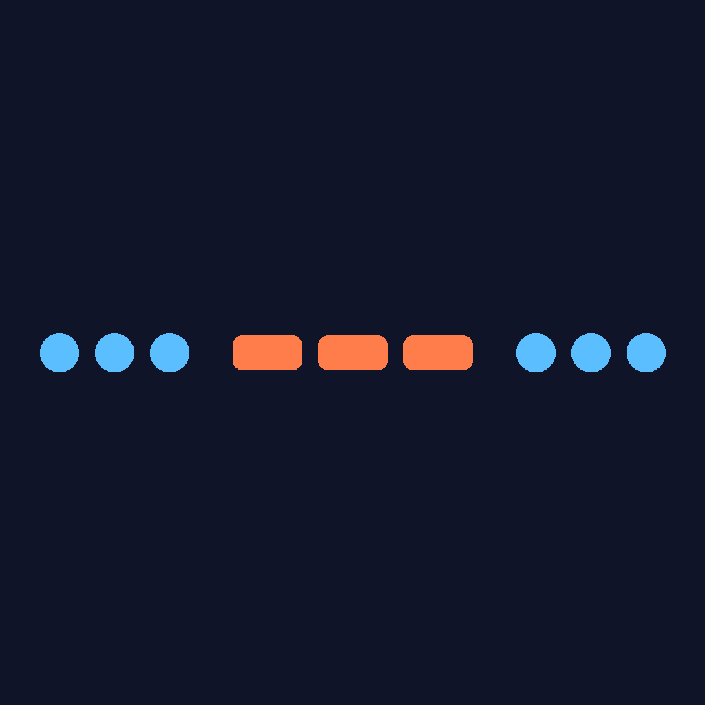
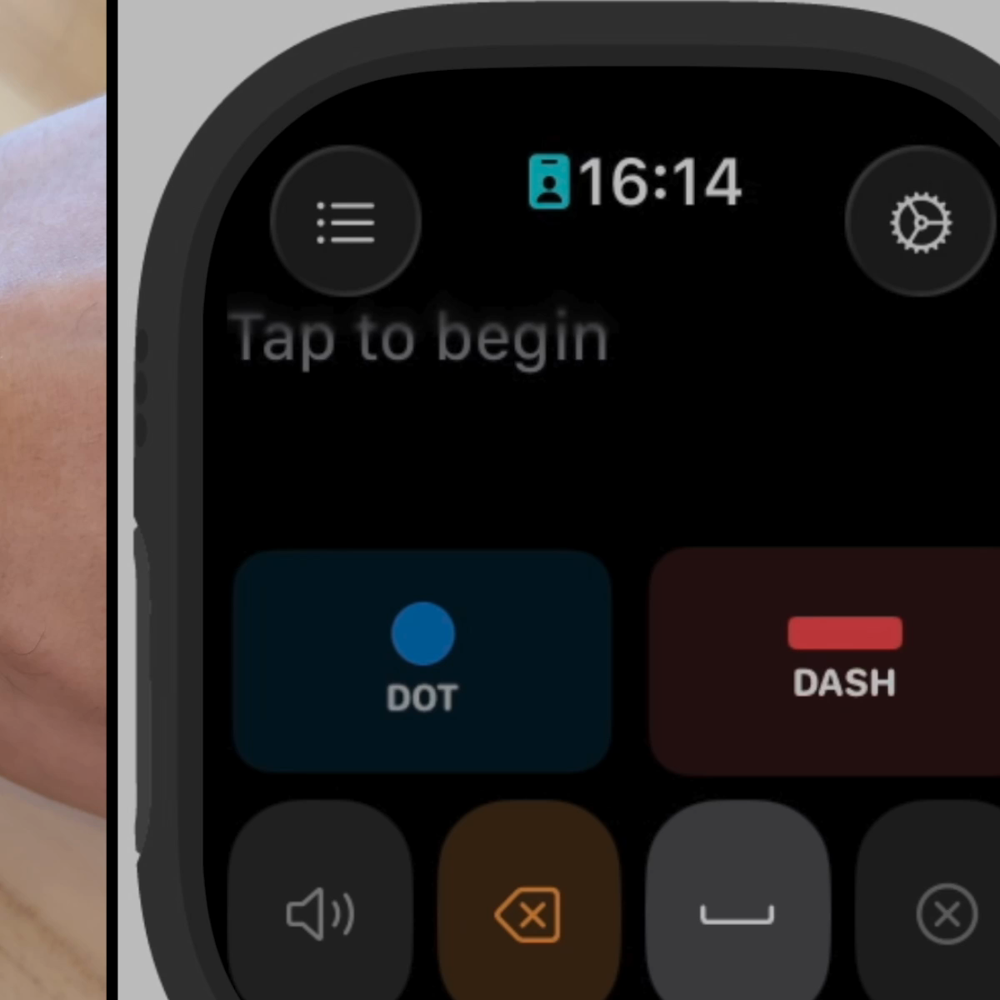
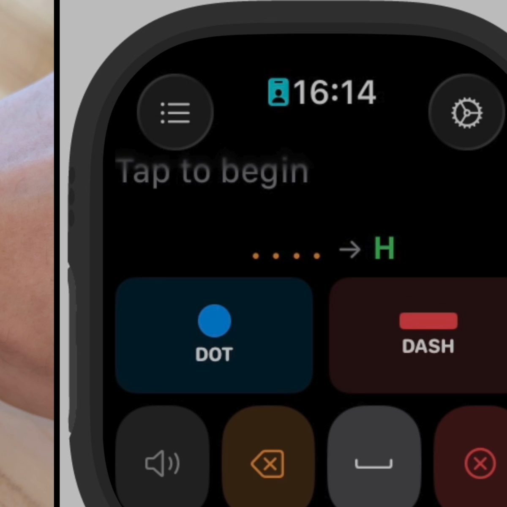
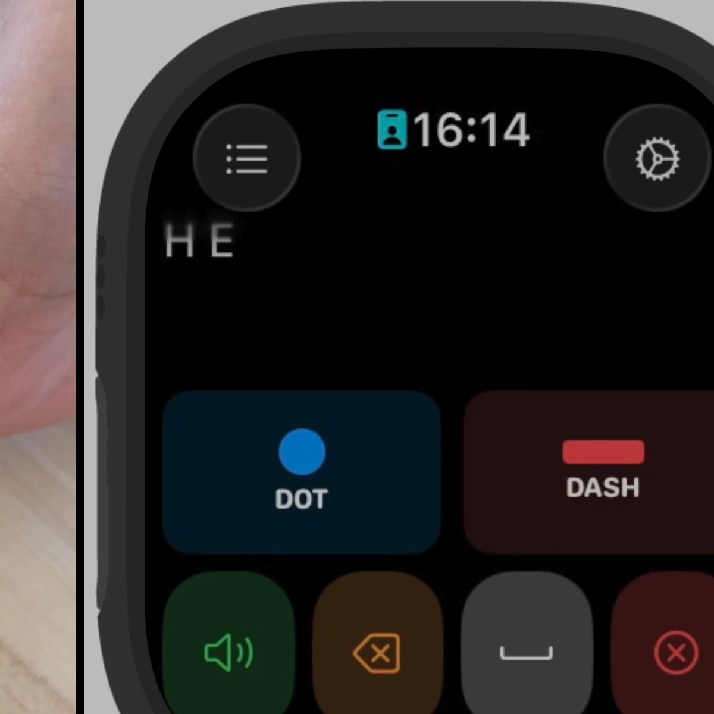
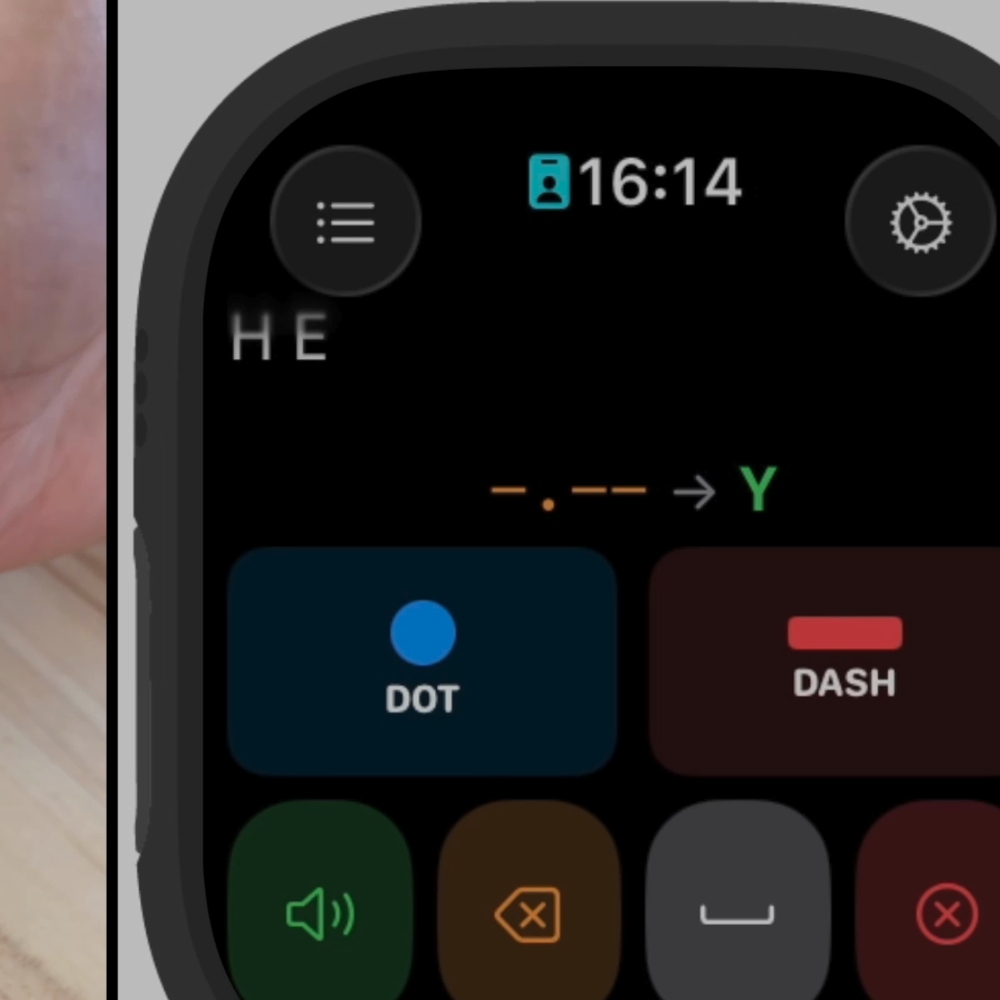
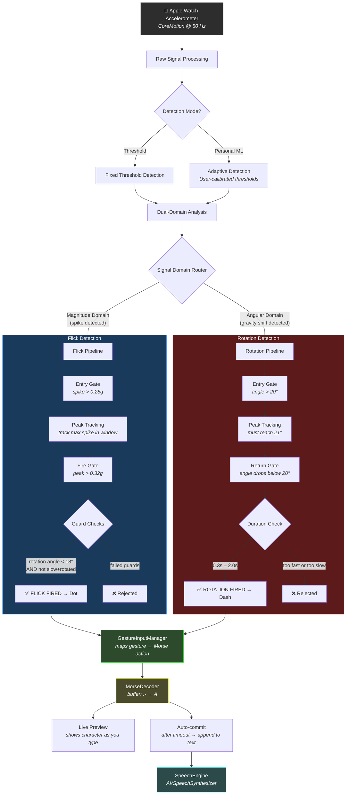
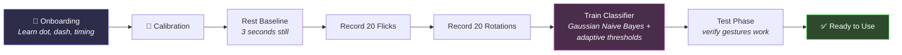

<p align="center">
  
</p>

<h1 align="center">MorseGesture</h1>

<p align="center">
  <strong>A watchOS Morse code communicator for people with ALS and motor impairments</strong>
</p>

<p align="center">
  <em>Designed and Developed by <a href="https://github.com/rijulchaturvedi">Rijul Chaturvedi</a></em>
</p>

<p align="center">
  
  
  
</p>

---

## Demo

<p align="center">
  <video src="./assets/demo.mp4" poster="./assets/hero.png" width="700" controls>
  </video>
</p>

> **Watch the full demo:** A screen recording is included at [`assets/demo.mp4`](assets/demo.mp4). It shows the app running on an Apple Watch Ultra, with the user inputting Morse code entirely through wrist gestures, decoded in real time with live preview and text-to-speech.

## Why This App Exists

Amyotrophic lateral sclerosis (ALS) progressively strips away voluntary muscle control. As the disease advances, people lose the ability to speak, type, and eventually move most of their body. But even in later stages, many retain some wrist and finger movement.

**MorseGesture turns those remaining movements into words.**

The app runs entirely on an Apple Watch with no phone required. It translates simple wrist gestures into Morse code, decodes them into text, and speaks the result aloud. For someone who can still flick their wrist or rotate their hand, this means the difference between silence and conversation.

Traditional AAC (augmentative and alternative communication) devices are expensive, bulky, and often require significant dexterity. MorseGesture offers a lightweight alternative that lives on a device many people already own.

### Who is this for?

- **People with ALS/MND** who retain partial wrist or hand mobility
- **Individuals with locked-in syndrome** who can still perform small wrist movements
- **People with severe motor impairments** from stroke, spinal cord injury, or muscular dystrophy
- **Caregivers and therapists** looking for accessible communication tools
- **Accessibility researchers** exploring gesture-based input methods

## Screenshots

<p align="center">
  
  &nbsp;&nbsp;
  
  &nbsp;&nbsp;
  
  &nbsp;&nbsp;
  
</p>

<p align="center">
  <em>Left to right: home screen, typing "H" (four dots), decoded "H E", building "Y" (dash-dot-dash-dash)</em>
</p>

## How It Works

The app detects two primary gestures using the Apple Watch's built-in accelerometer at 50 Hz:

| Gesture | Motion | Morse Symbol | Signal Domain |
|---------|--------|-------------|---------------|
| **Flick** | Quick wrist snap (like flicking water off your hand) | Dot ( `.` ) | Acceleration magnitude spike |
| **Rotation** | Slow wrist turn (like turning a doorknob) | Dash ( `-` ) | Gravity vector shift in x-z plane |

These gestures operate on **completely different signal domains**, which makes them naturally resistant to cross-triggering. A flick produces a sharp spike that lasts under 250ms. A rotation smoothly shifts the gravity vector over 300ms-2s with no spike at all.

After inputting dots and dashes, the app auto-commits characters after a configurable timeout, inserts word spaces after a longer pause, and can speak the decoded text aloud.

## Architecture Flowchart



### Calibration Flow



## Features

### Gesture Detection
- **Dual-domain signal processing.** Flick detection uses acceleration magnitude, rotation detection uses gravity vector angle. They cannot interfere with each other.
- **Two-threshold flick system.** A low entry threshold starts tracking, a higher fire threshold validates the peak. This filters out noise while catching real flicks.
- **Adaptive personal calibration.** The app learns your specific gesture patterns from 20 flick and 20 rotation samples, then derives personalized detection thresholds using supervised parameter estimation.
- **Guard rails.** Rotation angle guards, slow-with-rotation rejection, wind-up suppression, and gravity drift adaptation all work together to prevent false fires.

### Communication
- **Real-time Morse decoding** with live character preview as you type dots and dashes
- **Text-to-speech output** via AVSpeechSynthesizer, with configurable rate and pitch
- **Predictive shortcuts.** Type "HL" to expand to "HELP", "911" to expand to "CALL 911", and more. Organized by category: emergency, medical, and daily phrases.
- **Auto-commit timing.** Characters commit after a configurable pause (default 2.5s), word spaces insert after a longer pause (default 4.5s).

### Accessibility
- **No phone required.** Runs standalone on Apple Watch.
- **Multiple input modes.** Accelerometer gestures, screen tap, Apple Double Tap (pinch), or hybrid combinations.
- **Haptic feedback** confirms every input with a tactile tap
- **VoiceOver compatible** with full accessibility labels and hints
- **Guided onboarding** teaches Morse code from scratch, step by step

## Project Structure

```
MorseGesture/
├── MorseGesture Watch App/
│   ├── MorseGestureApp.swift              # App entry point, environment setup
│   ├── ContentView.swift                  # Main UI: text display, DOT/DASH buttons, action bar
│   ├── OnboardingView.swift               # Step-by-step Morse tutorial (8 screens)
│   ├── GestureCalibrationView.swift       # Personal gesture calibration flow
│   ├── AccelerometerGestureDetector.swift  # Core gesture detection engine (50Hz accelerometer)
│   ├── PersonalGestureClassifier.swift    # ML classifier with Gaussian NB + adaptive thresholds
│   ├── GestureRecorder.swift              # Records raw gesture samples for calibration
│   ├── GestureInputManager.swift          # Maps gestures → Morse actions, manages timing
│   ├── MorseDecoder.swift                 # Morse buffer → character decoding engine
│   ├── HapticFeedbackManager.swift        # Haptic feedback via WKInterfaceDevice
│   ├── SpeechEngine.swift                 # Text-to-speech via AVSpeechSynthesizer
│   ├── PredictiveShortcuts.swift          # Shortcode expansion (HL → HELP, etc.)
│   ├── AccessibilityGestureHandler.swift  # AssistiveTouch integration
│   └── Assets.xcassets/                   # App icon and assets
├── MorseGesture.xcodeproj/                # Xcode project configuration
├── assets/                                # README images and demo video
└── README.md
```

## Requirements

- **watchOS 10.0+**
- **Xcode 15.0+**
- **Apple Watch** (physical device required for accelerometer gestures, the simulator does not generate motion data)

## Getting Started

1. **Clone the repository**
   ```bash
   git clone https://github.com/rijulchaturvedi/MorseGesture.git
   cd MorseGesture
   ```

2. **Open in Xcode**
   ```bash
   open MorseGesture.xcodeproj
   ```

3. **Select your Apple Watch** as the run destination (or a watchOS simulator for UI-only testing)

4. **Build and run** (`Cmd + R`)

5. **On first launch**, the app walks you through onboarding and gesture calibration. Follow the prompts to record 20 flick and 20 rotation samples.

## Configuration

All settings are adjustable in the app's Settings sheet (gear icon):

| Setting | Default | Description |
|---------|---------|-------------|
| Input Mode | Accelerometer | Choose between Tap, Accelerometer, Double Tap + Clench, or AssistiveTouch |
| Character Timeout | 2.5s | Time before the current Morse buffer auto-commits |
| Word Space Timeout | 4.5s | Time before a word space is inserted |
| Speech Rate | 0.4 | Text-to-speech speed (0.1 to 1.0) |
| Speech Pitch | 1.0 | Text-to-speech pitch (0.5 to 2.0) |
| Haptic Feedback | On | Tactile confirmation for each input |
| Gesture Mapping | Flick=Dot, Rotation=Dash | Reassign any gesture to any Morse action |

## Morse Code Quick Reference

```
A  .-      N  -.      1  .----
B  -...    O  ---     2  ..---
C  -.-.    P  .--.    3  ...--
D  -..     Q  --.-    4  ....-
E  .       R  .-.     5  .....
F  ..-.    S  ...     6  -....
G  --.     T  -       7  --...
H  ....    U  ..-     8  ---..
I  ..      V  ...-    9  ----.
J  .---    W  .--     0  -----
K  -.-     X  -..-
L  .-..    Y  -.--
M  --      Z  --..
```

## Important Notice

> **This project is proprietary software.** The source code is published on GitHub for portfolio and reference purposes only. You may **not** copy, modify, distribute, or use any part of this codebase in your own projects without explicit written permission from the author. See the [LICENSE](LICENSE) file for full terms.

If you are interested in collaborating, licensing the technology, or adapting this for a specific accessibility need, please reach out directly.

## License

Copyright (c) 2025-2026 Rijul Chaturvedi. All rights reserved.

This software is proprietary. No permission is granted to use, copy, modify, merge, publish, distribute, sublicense, or sell copies of this software. See [LICENSE](LICENSE) for the full license text.

---

<p align="center">
  Designed and Developed by <strong>Rijul Chaturvedi</strong><br/>
  Built with the goal of giving a voice back to people who are losing theirs.
</p>
